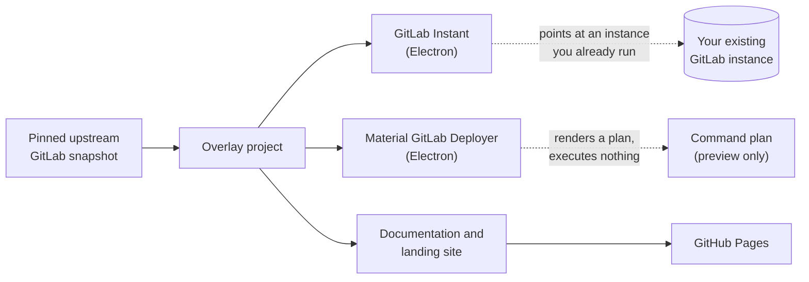
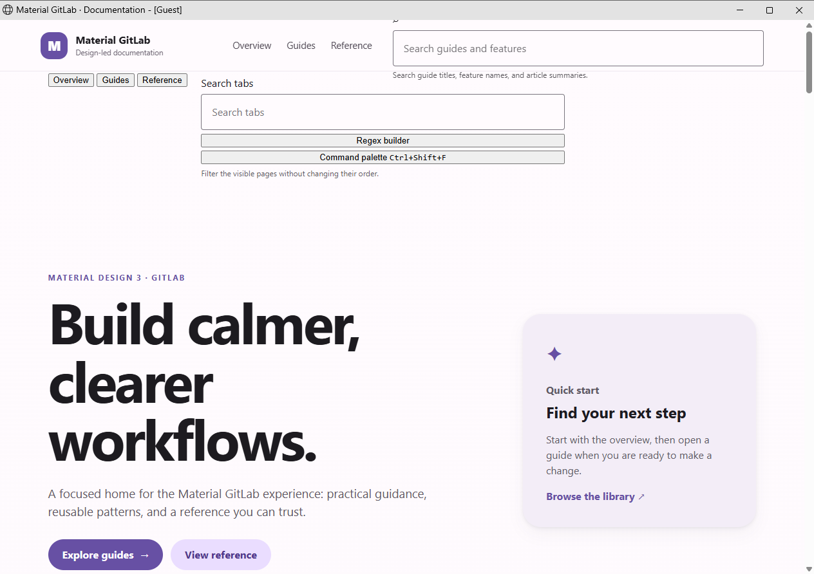
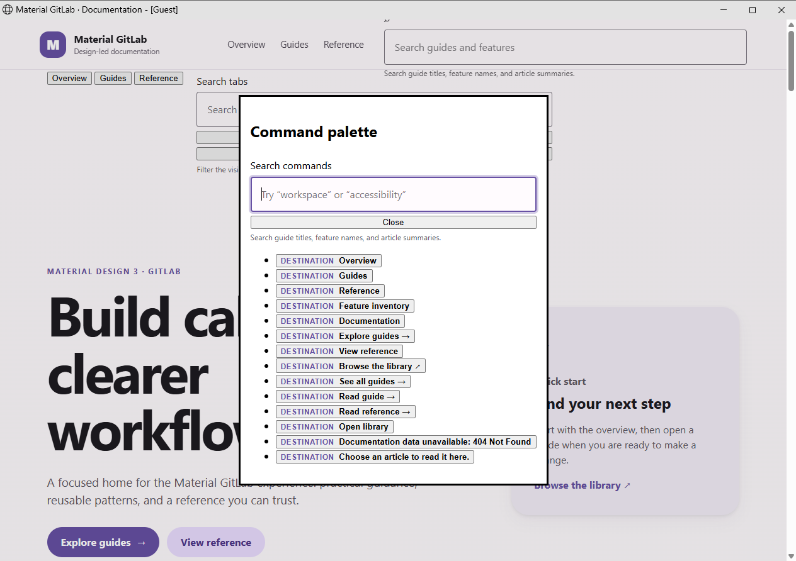
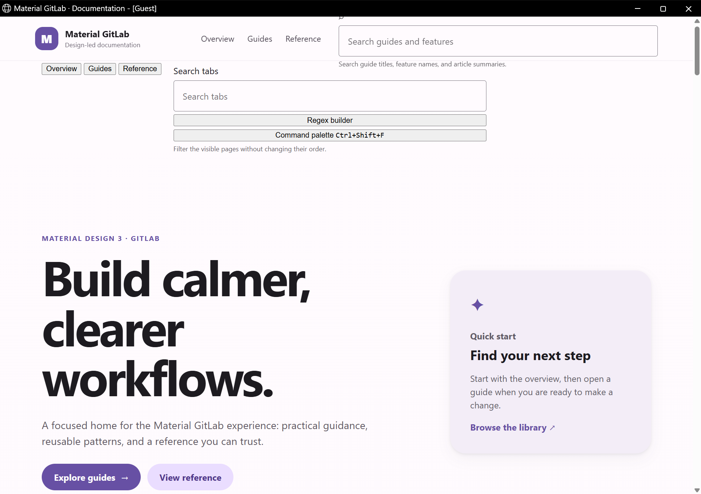
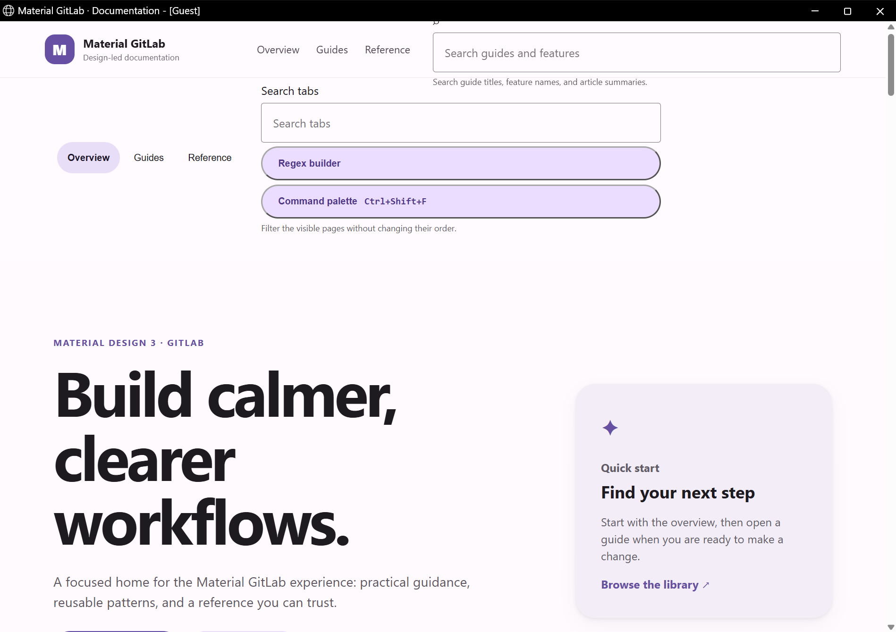

<div align="center">

# Material GitLab

**A Material Design overlay project built on a pinned upstream GitLab tree, with Windows tooling and a published documentation site.**

[](https://github.com/Ding-Ding-Projects/material-gitlab/actions/workflows/pages.yml)
[](https://github.com/Ding-Ding-Projects/material-gitlab/actions/workflows/windows-release.yml)


**Site:** [ding-ding-projects.github.io/material-gitlab](https://ding-ding-projects.github.io/material-gitlab/)

</div>

---

## What this actually is, in one honest paragraph

This repository is a **Material Design overlay** around a pinned snapshot of upstream GitLab. It
tracks 107,565 files, but almost all of those are the upstream GitLab source, carried as a single
squashed import for provenance. The part this project actually wrote is small and specific: two
Windows desktop shells, a documentation and landing site, the release and Pages automation, and the
supporting scripts. If you are looking for a running GitLab, read
[Deployment status](#deployment-status-read-this-before-you-plan-anything) first, because the
honest answer is not the one the directory listing suggests.

> [!IMPORTANT]
> **The Material work is real, and nothing here can install it.** The fork modifies the GitLab
> application itself, across 376 files, but this repository builds no package and no image for it,
> so there is currently no `apt-get install` and no image to pull that gets you this project. Every
> install route that works today installs stock upstream GitLab instead. See
> [Installing this fork](#installing-this-fork) for exactly what is missing and what it would take.

---

## Contents

| Section | What you get |
| --- | --- |
| [Quick start](#quick-start) | The two commands that build this on a clean Windows machine |
| [What ships](#what-ships) | The two desktop tools and the site, and what each one really does |
| [Deployment status](#deployment-status-read-this-before-you-plan-anything) | The honest answer about deploying |
| [Installing this fork](#installing-this-fork) | Why you cannot yet, and exactly what is missing |
| [Running stock upstream GitLab](#running-stock-upstream-gitlab) | Docker over SSH, and the apt Omnibus install |
| [Screens](#screens) | Verified captures from the built artifact |
| [Repository layout](#repository-layout) | Where the overlay code lives inside the upstream tree |
| [Size of the work](#size-of-the-work) | Measured line counts and a human time estimate |
| [Provenance](#provenance) | The pinned upstream commit and its fail closed validator |
| [Verification](#verification) | What passes, what fails, and what has never run |
| [Releases](#releases) | Why there are none yet |

---

## Quick start

Both scripts assume a completely fresh Windows machine. They bootstrap what is missing, build, and
report each phase with its elapsed time.

```bat
build.bat
build-installer.bat
```

Add `/s` (or `--silent`, or set `SILENT=1`) for an unattended run with no prompt:

```bat
build.bat /s
build-installer.bat /s
```

`build.bat` asks whether to launch the result only after a successful build. `build-installer.bat`
produces and verifies a local unsigned installer and never publishes, tags, or contacts a release
service. Full detail lives in [BUILD.md](BUILD.md).

<details>
<summary><b>Per package commands</b></summary>

```bash
# Deployer shell
cd tools/material-gitlab-deployer
npm run build      # tsc + asset copy
npm start          # launch the Electron preview shell
npm test           # node --test test/*.test.mjs

# Instant shell
cd tools/material-gitlab-instant
npm run build
npm start
npm test

# Documentation and landing site
cd site
npm run dev        # vite dev server
npm run build      # production build into site/dist
npm run preview
```

</details>

---

## What ships



### GitLab Instant

A small Electron shell that stores an origin URL, polls that origin's `/-/readiness` endpoint over
a bounded 2.5 second timeout, and opens a window on the instance once it answers `200` or `204`. It
refuses to follow redirects to an arbitrary host. It does **not** install, start, provision, or
deploy anything. It expects a GitLab instance that is already running and reachable.

### Material GitLab Deployer

An Electron shell that validates a deployment configuration for WSL2, local Docker, or SSH Docker
targets and renders an allowlisted, redacted command plan for review. Quoting its own
[README](tools/material-gitlab-deployer/README.md):

> The shell is preview-only. It validates configuration and renders an allowlisted plan, but never
> executes Docker, WSL2, SSH, or arbitrary shell commands.

The only child process it launches is `where.exe`, to test whether a command exists on the machine.
SSH `secretRefs` are opaque references for a future credential vault and are never resolved.

### Documentation and landing site

A Vite site under [`site/`](site/) carrying the landing page, offline documentation, a changelog
view, and a command palette. It is published to GitHub Pages from `main` only.

---

## Deployment status, read this before you plan anything

This section exists because the gap here is specific and easy to miss: **the Material work is real,
and there is no way to install it.**

| Route | State | Detail |
| --- | --- | --- |
| **The Material overlay itself** | **Real code, no install path** | 376 files under `app/assets/javascripts/material_system/`, including whole Vue surfaces, SCSS, and a runtime, plus 25 design contracts in `design/`. It is a genuine fork of the GitLab application, not a skin applied from outside. Nothing in this repository builds or packages it. |
| Omnibus or `.deb` for this fork | **Absent** | No `omnibus/` or `packaging/` directory. There is no apt repository serving this fork, so no `apt-get install` can reach it. |
| Container image for this fork | **Absent** | The only Dockerfiles are `Dockerfile.assets` (which is `FROM scratch` and merely carries `public/assets`), `qa/Dockerfile` and `vendor/Dockerfile`. None builds a runnable application image. |
| Helm or Kubernetes chart | **Absent** | No `chart/`, `helm/`, `k8s/`, or `deploy/` directory exists. |
| Source install of this fork | **Possible, unverified here** | `INSTALLATION_TYPE` is `source` and `VERSION` is `19.3.0-pre`, so upstream's from-source procedure applies to this tree. It needs Ruby, PostgreSQL, Redis, Gitaly, Workhorse and gitlab-shell, and this repository automates none of it and has never been proven to complete. |
| `docker-compose.yml` | **Runs stock upstream GitLab** | A working Compose file for the official `gitlab/gitlab-ce` image. Useful as a comparison baseline; it does **not** run this fork. It was previously a one line stub, `app:` plus an image reference, with no `services:` key, which `docker compose config` rejected with `additional properties 'app' not allowed`, so it could never have run at all. |
| Material GitLab Deployer | **Preview only** | Renders a command plan. Executes nothing, by explicit design. |
| GitLab Instant | **Client only** | Opens an instance you already run. Provisions nothing. |

---

## Installing this fork

This is the section that should matter, and right now it is the one with a hole in it.

> [!CAUTION]
> **There is no packaged install of this fork, and that is the single most important thing missing
> from this project.** The Material work is real application code, but nothing here turns it into
> something you can install. There is no `apt-get install material-gitlab`, because no apt
> repository serves it. There is no image to pull, because nothing builds one. Every install
> instruction that currently works installs **stock upstream GitLab**, which is precisely the
> product this fork exists to replace.

### What it would take

Two routes could make this fork installable. Neither is built, and neither has been verified in this
repository. They are recorded here so the work is scoped rather than vague, and they are the top
item on [ROADMAP.md](ROADMAP.md).

<details>
<summary><b>Route 1: build a container image from this tree</b> (the shorter path)</summary>

The Material work is largely frontend: Vue surfaces, SCSS, and a JavaScript runtime under
`app/assets/javascripts/material_system/`, plus the layout and navigation hooks that mount them.
That suggests compiling this tree's assets and layering them onto the official image at a matching
version, rather than rebuilding the whole application:

```dockerfile
# Sketch only. Not built, not tested, not shipped.
FROM gitlab/gitlab-ce:<version matching this tree>
COPY public/assets  /opt/gitlab/embedded/service/gitlab-rails/public/assets
COPY app/views      /opt/gitlab/embedded/service/gitlab-rails/app/views
```

The real work is producing `public/assets` from this tree, which needs the full Ruby and Node
toolchain and a successful `webpack` asset build, and then keeping the base image version pinned in
step with the tree. Anything served from the Rails side rather than compiled into assets has to be
layered too, and every layered path is a place the fork can silently drift from its base.

</details>

<details>
<summary><b>Route 2: build an Omnibus package</b> (the complete path)</summary>

Upstream ships GitLab as an Omnibus package, which is what both the apt route and the official image
use underneath. Producing one for this fork means running `omnibus-gitlab` against this tree instead
of upstream's, publishing the resulting `.deb` to a repository, and then `apt-get install` reaches
this fork the same way it reaches upstream today.

This is the honest answer to "why am I installing official GitLab", and it is a substantial piece of
build engineering rather than a documentation fix.

</details>

### What you can do today

Run this fork through upstream's from-source install procedure, using **this tree** in place of
upstream's. `INSTALLATION_TYPE` is already `source`, so the procedure applies. It needs Ruby,
PostgreSQL, Redis, Gitaly, Workhorse and gitlab-shell, it is long, and **this repository automates
none of it and has never been proven to complete it.** Treat it as a known-possible route rather
than a supported one, and expect to debug.

---

## Running stock upstream GitLab

> [!IMPORTANT]
> **Everything in this section installs stock upstream GitLab CE, not this fork.** You get the
> standard GitLab interface, without any of the Material work. It is here because it is genuinely
> useful as a comparison baseline for design parity, and because it is what the Compose file in this
> repository actually runs. If you came here to install this project, read
> [Installing this fork](#installing-this-fork) above instead.

**Sizing, before you start.** GitLab needs 4 GB of RAM as a practical minimum and is comfortable at
8 GB, plus 2 CPU cores and room for repositories. First boot takes several minutes before the
instance answers, on either route.

### Route A: Docker on a remote host over SSH

This is the closest match to how most people run a self-hosted GitLab. The
[`docker-compose.yml`](docker-compose.yml) in this repository is a working file for it.

**On the remote host**, once: install Docker Engine and the Compose plugin, and make sure your SSH
key can reach it.

**From your machine**, point the Docker CLI at that host rather than copying files around. The CLI
tunnels over SSH and runs everything remotely:

```bash
docker context create gitlab-host \
  --docker "host=ssh://deploy@docker.example.internal"
docker context use gitlab-host
docker context ls          # confirm the starred context is gitlab-host
```

<details>
<summary><b>Prefer not to create a context?</b></summary>

A single environment variable does the same thing for one command:

```bash
DOCKER_HOST="ssh://deploy@docker.example.internal" docker compose up -d
```

</details>

Then set where data lives on the remote host and bring it up:

```bash
export GITLAB_HOME=/srv/gitlab
export GITLAB_HOSTNAME=gitlab.example.com

docker compose up -d
docker compose ps
```

Watch the first boot until the health check reports healthy, which takes a few minutes:

```bash
docker compose logs -f gitlab      # Ctrl-C to stop following
docker inspect --format='{{.State.Health.Status}}' gitlab
```

Read the generated root password. **The file is deleted automatically 24 hours after the first
reconfigure**, so collect it early and change the password:

```bash
docker exec -it gitlab grep 'Password:' /etc/gitlab/initial_root_password
```

Sign in at `http://gitlab.example.com` as `root`. Clone URLs will use port `2224`, because the
container's port 22 is remapped to leave the host's own SSH alone.

<details>
<summary><b>Everyday operations</b></summary>

```bash
# Apply a configuration change made in $GITLAB_HOME/config/gitlab.rb
docker exec -it gitlab gitlab-ctl reconfigure

# Service status and logs
docker exec -it gitlab gitlab-ctl status
docker exec -it gitlab gitlab-ctl tail

# Upgrade: pull, recreate, and let it reconfigure on boot
docker compose pull
docker compose up -d

# Back up application data
docker exec -t gitlab gitlab-backup create
```

Do not skip minor versions when upgrading GitLab; follow the upstream upgrade path.

</details>

> [!TIP]
> Put GitLab behind a reverse proxy with TLS, or set `external_url` to an `https://` address and let
> the bundled Let's Encrypt integration obtain a certificate. Serving a real instance over plain HTTP
> sends credentials in the clear.

### Route B: apt install, the Omnibus package

For a Debian or Ubuntu host with no Docker involved. This is the officially packaged install.

```bash
# 1. Dependencies
sudo apt-get update
sudo apt-get install -y curl openssh-server ca-certificates tzdata perl

# 2. Optional: outbound email notifications.
#    Skip this if you plan to use an external SMTP server instead.
sudo apt-get install -y postfix

# 3. Add the official GitLab CE package repository
curl -fsSL https://packages.gitlab.com/install/repositories/gitlab/gitlab-ce/script.deb.sh \
  | sudo bash

# 4. Install, naming the URL the instance will serve on.
#    An https:// URL here requests a Let's Encrypt certificate automatically.
sudo EXTERNAL_URL="https://gitlab.example.com" apt-get install -y gitlab-ce
```

Then read the generated root password, which again is **deleted 24 hours** after the first
reconfigure:

```bash
sudo cat /etc/gitlab/initial_root_password
```

<details>
<summary><b>Everyday operations</b></summary>

```bash
# Edit configuration, then apply it
sudo editor /etc/gitlab/gitlab.rb
sudo gitlab-ctl reconfigure

# Service status and logs
sudo gitlab-ctl status
sudo gitlab-ctl tail

# Upgrade to the newest packaged version
sudo apt-get update && sudo apt-get install -y gitlab-ce

# Back up application data
sudo gitlab-backup create
```

Pin with `sudo apt-mark hold gitlab-ce` if you want to control upgrade timing yourself, and follow
the upstream upgrade path rather than jumping across minor versions.

</details>

> [!NOTE]
> Piping an install script into a shell runs remote code as root. That is the vendor's documented
> install path, and it is worth knowing that is what the command does. To inspect it first, download
> `script.deb.sh`, read it, then run it. GitLab also publishes the repository configuration steps
> manually if you would rather add the apt source and key by hand.

### Which route to pick

| | Docker over SSH | apt Omnibus |
| --- | --- | --- |
| Isolation from the host | Container | Installs into the host |
| Upgrades | Pull a new image tag | `apt-get install gitlab-ce` |
| Rollback | Retag and recreate | Reinstall the previous package version |
| Config lives in | `$GITLAB_HOME/config/gitlab.rb` | `/etc/gitlab/gitlab.rb` |
| Suits | A shared Docker host you already run | A dedicated machine or VM |

Both use the same Omnibus package underneath, so `gitlab-ctl` and `gitlab.rb` behave identically
once you are inside.

---

## Screens

Captures below are real, taken from the **built** site artifact rather than the source tree, on a
hidden Windows desktop with an isolated guest browser profile and a background capture by window
handle. Each has a committed JSON receipt recording its source commit, route, viewport, theme,
display scale, method, and SHA-256. Both hashes were re-verified against the files in this commit.

<details open>
<summary><b>Landing page</b> (1264 x 892, light theme, 100% scale)</summary>



Receipt: [`site/evidence/landing-and-offline-docs.json`](site/evidence/landing-and-offline-docs.json)

</details>

<details>
<summary><b>Command palette, open</b> (1264 x 892, light theme, 100% scale)</summary>



Receipt: [`site/evidence/command-palette.json`](site/evidence/command-palette.json)

</details>

<details open>
<summary><b>Navigation controls, before and after the unstyled-control repair</b> (1898 x 1339, light theme, 150% scale)</summary>

The navigation tab strip and its two tool buttons were rendering as **raw browser-default
controls**. The markup used `.tab-strip` and bare `<button>` elements while the stylesheet only
defines `.navigation-tabs`, `.navigation-tab` and the button classes, so no rule matched and the
browser fell back to its own defaults.

**Before.** Grey default buttons and a default input sitting above the styled Material header:



**After.** The same controls as Material pills and tonal buttons, with the selected tab carrying
its tonal background:



Receipt: [`site/evidence/navigation-generic-html.json`](site/evidence/navigation-generic-html.json)

Both captures come from the built `site/dist`, served locally and photographed on a hidden Windows
desktop through an isolated guest browser profile, with exactly one debugger page target verified
before each capture. Their SHA-256 values are recorded in the receipt.

Still open, and visible in the after image: the two tool buttons stack full width instead of
sitting inline beside the search field, and a gap remains before the hero. Both predate this repair.

</details>

> [!NOTE]
> **Coverage is partial and it is worth saying so.** These two captures were taken at commit
> `c74f6331`, since when `site/index.html` has changed by 3 lines. There are no captures yet of the
> two desktop shells, of settings, dialogs, empty states, error states, the narrow layout, or the
> dark theme. Those surfaces are undocumented visually until real captures exist for them.

---

## Repository layout

Only the rows marked **overlay** were written by this project. Everything else is the pinned
upstream GitLab source.

| Path | Origin | Purpose |
| --- | --- | --- |
| `tools/material-gitlab-deployer/` | overlay | Deployment plan preview shell |
| `tools/material-gitlab-instant/` | overlay | Existing instance client shell |
| `tools/design-reference/` | overlay | Design parity harness |
| `site/` | overlay | Landing page, offline docs, changelog, command palette |
| `.github/workflows/` | overlay | Pages publish and Windows release |
| `scripts/release/line_count.mjs` | overlay | Committed line counter used by release automation |
| `scripts/verify-upstream-overlay.mjs` | overlay | Fail closed provenance validator |
| `build.bat`, `build-installer.bat` | overlay | One click Windows bootstrap and packaging |
| `app/`, `lib/`, `ee/`, `spec/`, `doc/`, ... | upstream | Pinned GitLab source, carried for provenance |

---

## Size of the work

Measured on this commit. Counts exclude `site/dist` build output, lockfiles, and binary assets, so
these are hand written lines rather than generated or vendored ones.

| Area | Files | Lines |
| --- | ---: | ---: |
| `site/` | 53 | 4,497 |
| `tools/material-gitlab-deployer/` | 22 | 1,071 |
| `tools/material-gitlab-instant/` | 22 | 803 |
| Root docs and build scripts | 8 | 631 |
| `.github/workflows/` | 5 | 531 |
| Overlay scripts | 4 | 378 |
| **Overlay total** | **114** | **7,911** |
| Tracked files in the whole repository | 107,565 | mostly pinned upstream source |

<details>
<summary><b>How long would a person have taken to write this by hand?</b></summary>

**Estimated at roughly 3 to 6 working months.** This is an estimate, not a measurement. Nobody
built it by hand, and the figure should be argued with rather than quoted.

The arithmetic: 7,911 hand written lines, at a sustained 60 to 120 lines per day of reviewed,
documented, and packaged code, gives 66 to 132 working days. At about 21 working days per month
that is 3.1 to 6.3 months.

What the range deliberately excludes: the pinned upstream GitLab source, which is the work of
hundreds of contributors over more than a decade and is not counted here at all; generated files;
lockfiles; and build output. The full machine readable breakdown, including surviving line
authorship split between agent and human, is produced by the committed counter and attached to each
release as `LINE-COUNT.json`.

```bash
node scripts/release/line_count.mjs --json --revision=HEAD
```

</details>

---

## Provenance

The overlay is pinned to the official upstream GitLab repository at
`https://gitlab.com/gitlab-org/gitlab.git`, commit
`9479feaa8d186fa47fc98321d9721b8f87199b26`.

```bash
node scripts/verify-upstream-overlay.mjs
```

[`scripts/verify-upstream-overlay.mjs`](scripts/verify-upstream-overlay.mjs) fails closed when the
provenance record is missing, malformed, points somewhere other than the canonical GitLab
repository, or names a commit that is not reachable from this checkout's history. It currently
passes.

---

## Verification

All results below were run locally on this commit. Each was run after a clean rebuild, because
these tests read compiled output rather than source.

| Check | Command | Result |
| --- | --- | --- |
| Upstream provenance | `node scripts/verify-upstream-overlay.mjs` | **Passes** |
| Published file shorthand scan | `node scripts/verify-public-vocabulary.mjs` | **Passes**, 54,754 files scanned |
| Design reference parity | `node --test test/*.test.mjs` in `tools/design-reference` | **6 of 6 pass**, includes a red then green negative regression |
| Site completeness | `node scripts/completeness-check.mjs` in `site` | **Passes**, 28 rows, every removal rejected |
| Deployer renderer boundary | `npm test` in `tools/material-gitlab-deployer` | **1 of 1 passes** after a clean build |
| Instant renderer boundary | `npm test` in `tools/material-gitlab-instant` | **1 of 1 passes** |
| Instant TypeScript build | `npm run build` in `tools/material-gitlab-instant` | **Passes**, see the note below |
| Pages site build and publish | GitHub Actions, `pages.yml` | **Passes on `main`** |
| Windows release and installers | GitHub Actions, `windows-release.yml` | **Has never completed successfully** |

> [!NOTE]
> **Rebuild before trusting these tests.** They read compiled output, not source. A stale `dist/`
> left over from an earlier source revision makes the deployer boundary test fail against a build
> that no longer corresponds to the tree, which reads exactly like a source defect and is not one.
> Delete the output directory and rebuild first.

> [!CAUTION]
> **The Instant package carries an unreferenced parallel implementation that does not compile.**
> `src/main/lifecycle.ts` and `src/shared/model.ts` arrived together in commit `105c8e932`. Nothing
> imports `lifecycle.ts`, and only `lifecycle.ts` imports `model.ts`. `lifecycle.ts` imports
> `defaultConfiguration` and `parseInstanceConfig`, which `shared/configuration.ts` does not export,
> and `model.ts` declares `Window.gitlabInstant` as a required readonly `GitlabInstantApi` while
> `shared/bridge.ts` declares the same property as an optional `GitLabInstantBridge`. Two
> conflicting global declarations for one property cannot coexist, so their presence failed the
> whole package build with `TS2305`, `TS2687` and `TS2717`, and `tsc` exited 2.
>
> They are currently excluded in `tsconfig.json` rather than deleted, so the package builds while
> the half-finished work stays visible. The wired implementation is
> `main.ts` to `main/bridge.ts` to `shared/configuration.ts` and `shared/bridge.ts`. Finish that
> island deliberately or remove it, then drop the exclude.

### Note on CI scope

Neither workflow runs tests, lint, or type checks. That is deliberate, and it means a green badge
above says the site published or the installers built, and says nothing about code quality. Run the
package test commands locally and read their real output.

---

## Releases

**There are none yet, and no tags exist.** The Windows release workflow builds two unsigned
Squirrel.Windows installers, and until recently it could never publish: it inlined the entire
line count JSON report into the release body, which for a tree this size serialises to about
161,000 characters against GitHub's 125,000 character ceiling, so publication failed with HTTP 422
every time it got that far. Other runs were cancelled at a 120 minute job timeout.

Both causes are now addressed on `main`. The release body carries a summary and ships the full
report as a `LINE-COUNT.json` asset, a fail closed guard names any future overrun explicitly
instead of failing as an opaque 422, and the job timeout is raised to the 360 minute GitHub hosted
runner ceiling. The first release remains unproven until a run actually publishes one.

When installers do ship they will be **unsigned**, because code signing is deliberately disabled in
this project. Windows will show an unknown publisher or SmartScreen warning. That is expected and is
not a sign the download is damaged.

---

## 廣東話簡介

呢個 repo 係一個 Material Design 外殼項目,包住一份釘死咗版本嘅上游 GitLab 原始碼。成
107,565 個檔案入面,絕大部分都係上游 GitLab,係為咗記錄出處先擺入嚟。真正自己寫嘅得
114 個檔案、7,911 行:兩個 Windows 桌面殼、一個文件同落地網站、加上發佈同 Pages 嘅自動化。

**最緊要一句:呢度冇嘢部署到 GitLab。** 兩個桌面工具都係設定同預覽介面,設計上就係唔會執行
任何嘢;個 `docker-compose.yml` 得一行,指去上游嘅 `gitlab/gitlab-ce` 鏡像,唔關呢個項目事。
想真係跑 GitLab,請用上游嘅 Omnibus、官方 Docker 鏡像或者 Helm chart。

目前仲未出過任何 release。將來出嘅安裝檔一律唔簽名,Windows 會彈「不明發行者」警告,呢個
係預期之內,唔係個檔案有問題。

---

## License

The upstream GitLab source retains its original licensing; see [LICENSE](LICENSE), which begins
"Copyright (c) 2011-present GitLab Inc." The `tools/material-gitlab-instant` package declares MIT.
This is an independent overlay project and is not affiliated with, endorsed by, or supported by
GitLab Inc.
