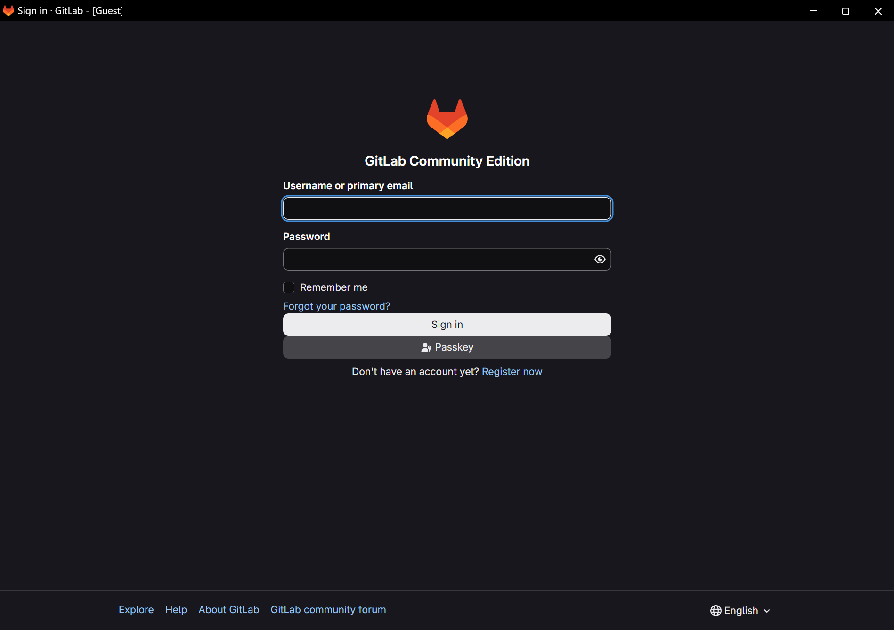

<div align="center">

# Material GitLab

**A Material Design overlay project built on a pinned upstream GitLab tree, with Windows tooling, a packaging pipeline, and a published documentation site.**

[](https://github.com/Ding-Ding-Projects/material-gitlab/actions/workflows/pages.yml)
[](https://github.com/Ding-Ding-Projects/material-gitlab/actions/workflows/windows-release.yml)


[](https://github.com/Ding-Ding-Projects/material-gitlab/releases/latest)

**Site:** [ding-ding-projects.github.io/material-gitlab](https://ding-ding-projects.github.io/material-gitlab/)

</div>

---

> [!NOTE]
> Design parity is being implemented and is not yet verified in the real Rails application; see
> [step 5](#5-design-parity). Packaging this fork as an installable Debian package and container
> image is in progress; see [step 3](#3-build-the-package-yourself) for the current state of that
> work and the [status table](#status-at-a-glance) below for everything else. The desktop tools have
> published installers on every push to `main`, for example
> [release windows-103-dd21e38302a9](https://github.com/Ding-Ding-Projects/material-gitlab/releases/tag/windows-103-dd21e38302a9).
> Reference renders and test fixtures in this README are not production screenshots.

## Contents

| Section | What you get |
| --- | --- |
| [Status at a glance](#status-at-a-glance) | One table: what works today and what does not |
| [1. Install with Docker](#1-install-with-docker) | Build or pull this fork's own container image |
| [2. Install the `.deb` on Debian or Ubuntu](#2-install-the-deb-on-debian-or-ubuntu) | The same package, installed directly on a host |
| [3. Build the package yourself](#3-build-the-package-yourself) | How the `.deb` and image in steps 1 and 2 get made, and the run in progress right now |
| [4. Build from source on Windows](#4-build-from-source-on-windows) | The GitLab frontend, and the two desktop tools that actually produce installers |
| [5. Design parity](#5-design-parity) | The reference viewer, the 25-row inventory, and what "strict" verification means |
| [6. Verify](#6-verify) | Every local check that was actually run, and its real result |
| [Releases](#releases) | What is published today, and what is not yet |
| [Screens](#screens) | Verified captures from the built artifact |
| [Repository layout](#repository-layout) | Where the overlay code lives inside the upstream tree |
| [Size of the work](#size-of-the-work) | Measured line counts, honestly scoped |
| [Provenance](#provenance) | The pinned upstream commit and its fail closed validator |
| [Running stock upstream GitLab as a comparison baseline](#running-stock-upstream-gitlab-as-a-comparison-baseline) | Docker Compose for plain GitLab, kept for design-parity comparison |

## What this actually is, in one honest paragraph

This repository is a **Material Design overlay** around a pinned snapshot of upstream GitLab. It
tracks 108,280 files, but the overwhelming majority of those are the upstream GitLab source, carried
as a single squashed import for provenance. The part this project actually wrote is specific: two
Windows desktop shells, a documentation and landing site, a Debian packaging pipeline and container
image recipe for this fork, the release and Pages automation, and the supporting scripts. This README
is written as steps you can run and check, in the order you would actually need them, rather than as
a narrative to read straight through.

## Status at a glance

| What | State |
| --- | --- |
| The Material overlay itself | Real code: 376 files under `app/assets/javascripts/material_system/`, plus 25 checked-in design contracts in `design/`. It is a genuine fork of the GitLab application, not a skin applied from outside. |
| [Install with Docker](#1-install-with-docker) | Compose file and container image recipe exist and build; no release has published a `.deb` or image for them to install **yet**. |
| [Install the `.deb` directly](#2-install-the-deb-on-debian-or-ubuntu) | Same package as above, same current blocker: no release has published one yet. |
| [Build the package yourself](#3-build-the-package-yourself) | The workflow and its scripts reach real compilation; a dispatch is in progress as this is written. See that section for the exact run and its state. |
| [Build the GitLab frontend from source on Windows](#4-build-from-source-on-windows) | Works today. Produces compiled frontend assets and a source archive, not a full running instance by itself. |
| The two desktop tools (Deployer, Instant) | Configuration and preview shells by explicit design; they install and provision nothing. Both publish unsigned Squirrel.Windows installers on every push to `main` — 34 tagged releases as of this writing. |
| [Design parity](#5-design-parity) | All 25 contracts are checked in and their production routes are `known`; **zero** rows have real capture evidence yet. The application still renders as stock GitLab today. |

---

## 1. Install with Docker

This builds or pulls the container image for **this fork** and runs it with the root
[`docker-compose.yml`](docker-compose.yml). It does not work yet against a published image or a
published `.deb`, because neither has published from this branch; see
[step 3](#3-build-the-package-yourself) for the current state of that build, and use the
[releases page](https://github.com/Ding-Ding-Projects/material-gitlab/releases) to check whether one
exists by the time you read this. Once one does, these are the real steps.

**Sizing, before you start.** GitLab needs 4 GB of RAM as a practical minimum and is comfortable at
8 GB, plus 2 CPU cores and room for repositories. First boot takes several minutes before the
instance answers. `docker-compose.yml` caps the container at `GITLAB_CPU_LIMIT` cores (default 4)
as well as `GITLAB_MEMORY_LIMIT`, so GitLab's bundled services cannot starve anything else running
on a shared host; raise it if the host has cores to spare and repositories are large.

**Step 1. Configure it**, in a `.env` file next to `docker-compose.yml` (never commit that file):

```bash
cat > .env <<'EOF'
GITLAB_HOSTNAME=gitlab.example.internal
GITLAB_HTTP_PORT=8929
GITLAB_SSH_PORT=2229
GITLAB_HOME=/srv/material-gitlab
# GITLAB_ROOT_PASSWORD=set-your-own-or-leave-unset-for-a-generated-one
GITLAB_MEMORY_LIMIT=10g
GITLAB_CPU_LIMIT=4
EOF
```

**Step 2. Get the image**, either by pulling the published one or building it locally from a
released `.deb`:

```bash
# Option A: pull the published image (once one exists; see step 3)
docker compose pull

# Option B: build it locally from a release .deb, no registry needed
MATERIAL_GITLAB_DEB_URL='<release .deb asset URL>' \
MATERIAL_GITLAB_VERSION='<version>-<sha12>' \
  docker compose build
```

**Check:** `docker compose config` prints a resolved `gitlab:` service with no errors, and
`docker image inspect ghcr.io/ding-ding-projects/material-gitlab:latest` (or your locally built tag)
succeeds.

**Step 3. Start it and wait for the health check:**

```bash
docker compose up -d
docker inspect --format '{{.State.Health.Status}}' material-gitlab
```

**Check:** the health status reads `healthy`. It starts as `starting` for the first few minutes; a
value of `unhealthy` means something failed and `docker compose logs -f material-gitlab` is the next
step, not a reason to assume the image is broken.

**Step 4. Get the initial root password:**

```bash
docker exec -it material-gitlab grep 'Password:' /etc/gitlab/initial_root_password
```

**Check:** the file exists and prints a password. It is **deleted automatically 24 hours** after the
first reconfigure, so collect it now and change it after signing in. If you set
`GITLAB_ROOT_PASSWORD` in `.env`, use that instead; the file will not exist.

**Step 5. Sign in** at `http://<GITLAB_HOSTNAME>:<GITLAB_HTTP_PORT>` as `root`. Clone URLs use the
port you set as `GITLAB_SSH_PORT` (default `2229`), because container port 22 is remapped so it
never collides with the host's own SSH.

<details>
<summary><b>Running this on a remote host over SSH</b></summary>

Point the Docker CLI at the remote host instead of copying files there; the CLI tunnels over SSH and
runs everything remotely.

```bash
docker context create material-gitlab-host \
  --docker "host=ssh://deploy@docker.example.internal"
docker context use material-gitlab-host
docker context ls          # confirm the starred context is material-gitlab-host
```

Or, for a single command without switching contexts:

```bash
DOCKER_HOST="ssh://deploy@docker.example.internal" docker compose up -d
```

**Check:** `docker context ls` shows the new context starred, or the one-off command reports the
same container names as a local run.

</details>

<details>
<summary><b>Everyday operations</b></summary>

```bash
# Apply a configuration change made in $GITLAB_HOME/config/gitlab.rb
docker exec -it material-gitlab gitlab-ctl reconfigure

# Service status and logs
docker exec -it material-gitlab gitlab-ctl status
docker exec -it material-gitlab gitlab-ctl tail

# Upgrade: pull a newer tag, recreate, and let it reconfigure on boot
docker compose pull
docker compose up -d

# Back up application data
docker exec -t material-gitlab gitlab-backup create
```

Do not skip minor versions when upgrading; follow the upstream upgrade path.

</details>

> [!TIP]
> Put GitLab behind a reverse proxy with TLS, or set `external_url` to an `https://` address in
> `GITLAB_OMNIBUS_CONFIG` and let the bundled Let's Encrypt integration obtain a certificate. Serving
> a real instance over plain HTTP sends credentials in the clear.

---

## 2. Install the `.deb` on Debian or Ubuntu

This installs the same package as step 1, directly on the host, with no Docker involved. It has the
same current blocker: it needs a published release, which does not exist yet as this is written; see
[step 3](#3-build-the-package-yourself).

**Step 1. Dependencies:**

```bash
sudo apt-get update
sudo apt-get install -y curl openssh-server ca-certificates tzdata perl
```

**Check:** each package reports "already the newest version" or installs cleanly.

**Step 2. Download and verify the package** from a release:

```bash
curl -fLo gitlab-ce.deb '<release .deb asset URL>'
curl -fLo SHA256SUMS.txt '<release SHA256SUMS.txt asset URL>'
sha256sum -c SHA256SUMS.txt --ignore-missing
```

**Check:** `sha256sum -c` prints `gitlab-ce.deb: OK`. Do not install a package that fails this check.

**Step 3. Install it, naming the URL the instance will serve on:**

```bash
sudo EXTERNAL_URL="https://gitlab.example.internal" dpkg -i gitlab-ce.deb
```

**Check:** `dpkg -i` exits 0 and the last lines of its own output say the install and reconfigure
succeeded. If `dpkg` reports missing dependencies, `sudo apt-get install -f` resolves them from the
packages installed in step 1.

**Step 4. Read the initial root password**, deleted 24 hours after the first reconfigure exactly as
in the Docker route:

```bash
sudo cat /etc/gitlab/initial_root_password
```

**Check:** a password prints. Sign in as `root` and change it.

<details>
<summary><b>Everyday operations</b></summary>

```bash
# Edit configuration, then apply it
sudo editor /etc/gitlab/gitlab.rb
sudo gitlab-ctl reconfigure

# Service status and logs
sudo gitlab-ctl status
sudo gitlab-ctl tail

# Back up application data
sudo gitlab-backup create
```

Pin with `sudo apt-mark hold gitlab-ce` if you want to control upgrade timing yourself.

</details>

<details>
<summary><b>On Windows: run the same package in WSL</b></summary>

A WSL2 distro of Ubuntu 24.04 runs this package natively, and Windows reaches it on
`localhost` through WSL2 port forwarding. [`deploy/scripts/wsl-install.sh`](deploy/scripts/wsl-install.sh)
does steps 1 to 4 above inside the distro in one command, verifying the download against the
release `SHA256SUMS.txt` on the way:

```bash
# Inside the distro, as root
bash deploy/scripts/wsl-install.sh '<release .deb asset URL>' http://localhost:8929
```

**Check:** the script ends with `healthy`, the installed version, and the sign-in URL. Keep a shell
open in the distro (or run `wsl -d <distro> -- sleep infinity` from Windows) while you use the
instance: WSL2 stops a distro seconds after its last command exits, and GitLab stops with it. The
full route, including the memory note, is in [`deploy/README.md`](deploy/README.md).

</details>

---

## 3. Build the package yourself

This is how the `.deb` and the container image in steps 1 and 2 actually get produced. A full
Omnibus build compiles Ruby, PostgreSQL, Redis, nginx, and the Go components from source, so it is
deliberately manual rather than run on every push.

**What exists today:** [`.github/workflows/omnibus-package.yml`](.github/workflows/omnibus-package.yml)
and its supporting scripts in [`scripts/omnibus/`](scripts/omnibus/). As of this writing the workflow
has been dispatched multiple times: eight runs failed for seven distinct causes (all recorded in
[`HANDOFF.md`](HANDOFF.md)), and one run compiled the entire package (about two hours and five
minutes) before failing only at the final health check, on musl-linked Node binaries under
`ee/frontend_islands/node_modules` that upstream deletes only in EE builds. The fix for that,
[`scripts/omnibus/patch-frontend-islands-cleanup.sh`](scripts/omnibus/patch-frontend-islands-cleanup.sh),
is committed. **A run dispatched against that fix, [run 34293113846](https://github.com/Ding-Ding-Projects/material-gitlab/actions/runs/34293113846),
was still in progress as this was written** (dispatched 2026-09-09T00:00:25Z UTC). Check the
[Actions tab](https://github.com/Ding-Ding-Projects/material-gitlab/actions/workflows/omnibus-package.yml)
or the [releases page](https://github.com/Ding-Ding-Projects/material-gitlab/releases) for whether it
(or a later run) has published by the time you read this.

**What a successful run publishes:** a release tagged `omnibus-<version>-<sha12>` (for example
`omnibus-19.3.0-pre-abcdef012345`) carrying `gitlab-ce_*_amd64.deb`, `SHA256SUMS.txt`,
`LINE-COUNT.json`, and a dim-sum photo, plus the container image
`ghcr.io/ding-ding-projects/material-gitlab:<version>-<sha12>` and `:latest`. **The GHCR package is
private until the repository owner makes it public in GitHub's package settings**; the `.deb` and the
local `docker compose build` route in [step 1](#1-install-with-docker) need no registry login either
way.

### Run it yourself: dispatch the workflow

```bash
gh workflow run omnibus-package.yml --repo Ding-Ding-Projects/material-gitlab -f omnibus_ref=19.3.0+ce.0
gh run watch --repo Ding-Ding-Projects/material-gitlab
```

**Check:** `gh run watch` follows the run to completion; a successful one ends by printing the
published release tag. The job has a 360-minute timeout (the GitHub-hosted runner ceiling); a run
that hits it has not failed on a defect, it has genuinely run out of time.

### Or reproduce it on your own Linux Docker host

The workflow is a thin wrapper around committed scripts, so the same steps run identically outside
GitHub Actions:

```bash
git clone --depth 1 --branch 19.3.0+ce.0 https://gitlab.com/gitlab-org/omnibus-gitlab.git omnibus-gitlab
scripts/omnibus/repoint-sources.sh omnibus-gitlab "https://github.com/Ding-Ding-Projects/material-gitlab.git"
scripts/omnibus/patch-frontend-islands-cleanup.sh omnibus-gitlab
scripts/omnibus/route-gnu-mirror.sh omnibus-gitlab
scripts/omnibus/read-toolchain.sh omnibus-gitlab   # prints openssl_version=...

OMNIBUS_DIR=omnibus-gitlab OMNIBUS_REF=19.3.0+ce.0 \
GITLAB_VERSION="$(git rev-parse HEAD)" BUILD_VERSION="$(cat VERSION)" \
OPENSSL_VERSION=<value from read-toolchain.sh> \
  scripts/omnibus/build-package.sh

scripts/omnibus/verify-package.sh omnibus-gitlab/pkg "$(cat VERSION)"
```

**Check:** `verify-package.sh` prints a SHA-256 and byte count and exits 0. It fails closed if the
package is missing any of the tree's `app/helpers/material_*_helper.rb` files or the compiled fork-only
`pages.agent_memory` entry (Omnibus never ships `app/assets` source, so the check uses what does ship), has fewer
than 1,000 compiled webpack files, still contains musl-linked binaries, or reports the wrong
`VERSION` inside the package — each a specific, named reason rather than a generic build failure.

The package is **unsigned**, because code signing is disabled throughout this project. No tests,
lint, or static analysis run as part of this build. The tree is EE-layout source built under the CE
Omnibus project, so the running instance is the Free tier; paid-tier features show their normal
licence prompts.

### Alternative: layer compiled assets onto the official image

A lighter, unverified alternative to building a full Omnibus package: compile this tree's frontend
assets standalone (see [step 4](#4-build-from-source-on-windows) on Windows, or
`yarn install && yarn webpack-prod` on Linux, neither of which needs the Rails stack) and layer the
resulting `public/assets` plus the changed `app/views` onto the official `gitlab/gitlab-ce` image at
a matching version. Nobody has built or tested this route. The base image and tree versions must be
kept pinned in step — the tree is `19.3.0-pre` while the most recently published upstream package was
`19.3.1-ce.0` at the time this was checked — and anything the Rails side serves outside compiled
assets has to be layered too, which is a place this fork can silently drift from its base. The
Omnibus package above is the complete, verified route; this is recorded only so the option is scoped
rather than reinvented.

---

## 4. Build from source on Windows

This builds the GitLab **frontend** and the two **desktop tools**. It does not, by itself, produce a
runnable full GitLab instance (that needs Ruby, PostgreSQL, Redis, Gitaly, Workhorse, and
gitlab-shell — see steps 1 through 3 instead), and the root scripts do not produce a native Windows
installer. Full detail, including exactly what each of the three script pairs in this repository
produces, lives in [BUILD.md](BUILD.md).

### The GitLab frontend

```bat
build.bat
build-installer.bat
```

Add `/s` (or `--silent`, or set `SILENT=1`) for an unattended run with no prompt.

**Check:** `build.bat` reports `[OK] Frontend build completed successfully.` and leaves compiled
output in `public\assets`. `build-installer.bat` reports an artifact path, byte size, and SHA-256 for
an unsigned **source ZIP** (`build\artifacts\gitlab-source-<version>-<sha12>.zip`) — this is a
`git archive` of the checkout, not an installer.

### The two desktop tools

Each has its own pair of scripts, and these two **do** produce real installers:

```bash
cd tools/material-gitlab-deployer
npm run build      # tsc + asset copy
npm start           # launch the Electron preview shell
npm test             # node --test test/*.test.mjs
build.bat /s
build-installer.bat /s   # unsigned Squirrel.Windows Setup.exe

cd ../material-gitlab-instant
npm run build
npm start
npm test
build.bat /s
build-installer.bat /s   # unsigned Squirrel.Windows Setup.exe
```

**Check:** each `build-installer.bat` leaves a `Setup.exe`, a `RELEASES` index, and a full `.nupkg`
in that package's Squirrel output directory (`dist/squirrel-windows` for the Deployer,
`installer/squirrel-windows` for Instant), and reports the installer as `NotSigned`. This is exactly
what [`windows-release.yml`](.github/workflows/windows-release.yml) runs on every push to `main`, so
a local run reproduces the same artifacts CI publishes.

### Documentation and landing site

```bash
cd site
npm run dev        # vite dev server
npm run build      # production build into site/dist; also runs the site's own contract tests
npm run preview
```

---

## 5. Design parity

The 25 checked-in design contracts under [`design/`](design/) are the specification this fork is
being built toward, rendered by the dedicated reference application in
[`tools/design-reference/`](tools/design-reference/README.md) so the original files are served
directly rather than copied into a second implementation.

**Run a reference route:**

```bash
cd tools/design-reference
npm install
npm start -- --surface=issues --state=default --theme=light --width=1280 --height=800 --scale=1
```

**Check:** the application accepts any of the 25 stable surface slugs listed in
[`design/parity-inventory.json`](design/parity-inventory.json), freezes time and random values, and
blocks requests to non-loopback origins.

**What "strict" means.** [`tools/design-reference/README.md`](tools/design-reference/README.md)
documents the full evidence workflow (`parity-guard.mjs`, `capture.mjs`, `side-by-side.mjs`,
`diff.mjs`, `review-diff.mjs`) in detail; it is not repeated here. In short: `parity-guard.mjs`
validates the hand-written inventory structurally and always runs; `parity-guard.mjs --strict` is the
completion command, and it stays red until every one of the 25 rows has verified raw captures from
both the reference application and the real built application, a side-by-side comparison, a diff, an
audited Material Design 3 control review, and hash-bound receipts tying all of it to one exact source
commit and tuple (surface, state, theme, viewport, scale).

**Current state, verified from [`design/parity-inventory.json`](design/parity-inventory.json) on this
commit:** all 25 rows record `productionRouteStatus: "known"`, and all 25 rows record every one of
`referenceRaw`, `builtRaw`, `sideBySide`, and `diff` as `pending`. The inventory's own `sourceCommit`
is the literal string `WORKTREE`, meaning no row is yet bound to a real revision. A capture driver and
layout matrix for this evidence are in progress on a sibling branch; this README does not document
their command-line interface, since it is not yet stable — watch
[`tools/design-reference/README.md`](tools/design-reference/README.md) instead.

The gap this measures is real and specific, not a rounding error: a real instance serving this fork's
own compiled frontend, measured on `/admin` while signed in as an administrator, showed 35 `gl-mds`
classes (GitLab's own design system) in the content area and **zero** Material classes, **zero**
Material Symbols icons, **zero** `md3` token classes, and **zero** Vue application roots. The only
Material presence anywhere on the page was `m3-shell-*` applied to GitLab's stock `super-sidebar`.
[`doc/development/design_parity_audit.md`](doc/development/design_parity_audit.md) and
[`HANDOFF.md`](HANDOFF.md) have the full detail.

---

## 6. Verify

All results below were run locally, from this worktree, on 2026-09-08/09.

| Check | Command | Result |
| --- | --- | --- |
| Upstream provenance | `node scripts/verify-upstream-overlay.mjs` | Passes |
| Published file shorthand scan | `PRIVATE_VOCABULARY_FILE=<path> node scripts/verify-public-vocabulary.mjs` | Passes |
| Site build and its own contract tests | `cd site && npm run build` | Passes |
| Site completeness inventory | `node scripts/completeness-check.mjs` (from `site/`) | Passes, 29 rows, every removal rejected |
| Relative links across README.md, deploy/README.md, HANDOFF.md, ROADMAP.md | one-off Node script (see below) | Every internal link resolves |
| Committed line counter | `node scripts/release/line_count.mjs --json --no-blame --revision=HEAD` | See [Size of the work](#size-of-the-work) |

Exact commands and the real output they produced are in this branch's pull request description and
commit history, not retyped here; run them yourself against this commit to reproduce them.

> [!NOTE]
> Neither `pages.yml` nor `windows-release.yml` runs tests, lint, or type checks. That is deliberate:
> a green badge above says the site published or the installers built, and says nothing about code
> quality. `omnibus-package.yml` likewise runs no tests. Run the package test commands in
> [step 4](#4-build-from-source-on-windows) locally and read their real output.

---

## Releases

**34 tagged Windows releases exist as of this writing** (`windows-<run-number>-<sha12>`, for example
`windows-103-dd21e38302a9`, published 2026-09-08T22:50:34Z UTC), each carrying two unsigned
Squirrel.Windows installer sets. [`windows-release.yml`](.github/workflows/windows-release.yml)
publishes a new one on every push to `main`, so this count grows continuously — the
[releases page](https://github.com/Ding-Ding-Projects/material-gitlab/releases) is the live source of
truth, not this paragraph.

**No Omnibus package or container image release exists yet.** [Step 3](#3-build-the-package-yourself)
has the exact workflow, the run in progress as this is written, and what a successful run will
publish once one completes.

Every installer in this project is **unsigned**, because code signing is deliberately disabled.
Windows will show an unknown publisher or SmartScreen warning on the desktop-tool installers. That is
expected and is not a sign the download is damaged.

---

## Original 3D illustrations

The [Blender graphics pack](design/3d/README.md) contains four original compositions in
light and dark treatments, with transparent PNG masters, responsive WebP images and editable
Blender scenes. See the [contact sheet](site/assets/3d/contact-sheet.jpg),
[file manifest](site/assets/3d/manifest.json) and [reproduction procedure](design/3d/OPERATIONS.md).
These are conceptual illustrations for the landing page, not screenshots or claims about
deployed functionality. Page layout and image placement are unchanged by this asset delivery.

---

## Screens

Captures below are real, taken from the **built** site artifact rather than the source tree, on a
hidden Windows desktop with an isolated guest browser profile and a background capture by window
handle. Each has a committed JSON receipt recording its source commit, route, viewport, theme,
display scale, method, and SHA-256. Both hashes were re-verified against the files in this commit.

<details open>
<summary><b>Landing page</b> (1264 x 892, light theme, 100% scale)</summary>


Receipt: [`site/evidence/landing-and-offline-docs.json`](site/evidence/landing-and-offline-docs.json)

</details>

<details>
<summary><b>Command palette, open</b> (1264 x 892, light theme, 100% scale)</summary>


Receipt: [`site/evidence/command-palette.json`](site/evidence/command-palette.json)

</details>

<details open>
<summary><b>The Material admin surface mounted in the running application</b> (1440 x 960, dark theme)</summary>

This is the fork's own Material surface rendering inside a real GitLab instance, not a design file
and not a prototype. The content area is
`app/assets/javascripts/material_system/surfaces/Admin`: the **Admin area** heading with its
instance chip, Material segmented tabs with **Overview** selected in a tonal pill, a Material search
field carrying the regex and tools affordances, and the instance health card.


Receipt: [`site/evidence/instance-running.json`](site/evidence/instance-running.json)

> [!NOTE]
> **Two honest limits are visible here.** GitLab's stock chrome still surrounds the surface: the left
> sidebar and top bar are upstream's, not the fork's, so this is a mounted surface rather than the
> full replacement the design specifies. And the instance health card is empty, because the data the
> surface expects is not populated on this instance.
>
> Getting even this far needed three separate repairs, recorded because each was invisible from the
> source: the compiled assets (the execute-bit fix), a HAML syntax error in the view that meant it
> had **never** rendered, and the fork's own admin controller and route, without which the view
> raises `undefined method 'admin_dashboard_actions_path'`. **Views and assets alone cannot mount a
> Material surface.** That is why the layered-assets alternative in
> [step 3](#3-build-the-package-yourself) is not sufficient on its own, and why the Omnibus package
> is the real answer.

</details>

<details>
<summary><b>A running instance serving this fork's compiled frontend</b> (1898 x 1339, dark theme, 150% scale)</summary>

This is a real GitLab instance, Omnibus 19.3.1 on WSL2, with this fork's webpack output layered
over the stock one: **11,317 compiled files replacing the stock 7,237**, sprockets assets left
intact. It is the first time this fork's frontend has been built and served at all, which was only
possible after restoring the execute bits the import had stripped.



Receipt: [`site/evidence/instance-running.json`](site/evidence/instance-running.json)

> [!IMPORTANT]
> **Read this one honestly: it renders as stock GitLab, and that is the expected result.**
> `pages/devise/sessions/new.js` imports only `login.scss` from `material_system`, so no Material
> surface mounts on the sign-in page. The assets are genuinely this fork's; the Material work simply
> is not wired into this surface. That is the same gap [step 5](#5-design-parity) records: 25
> design contracts, 25 written surface directories, and only three mount points that any Rails view
> actually renders.

</details>

<details open>
<summary><b>Navigation controls, before and after the unstyled-control repair</b> (1898 x 1339, light theme, 150% scale)</summary>

The navigation tab strip and its two tool buttons were rendering as **raw browser-default
controls**. The markup used `.tab-strip` and bare `<button>` elements while the stylesheet only
defines `.navigation-tabs`, `.navigation-tab` and the button classes, so no rule matched and the
browser fell back to its own defaults.

**Before.** Grey default buttons and a default input sitting above the styled Material header:


**After.** The same controls as Material pills and tonal buttons, with the selected tab carrying
its tonal background:


Receipt: [`site/evidence/navigation-generic-html.json`](site/evidence/navigation-generic-html.json)

Both captures come from the built `site/dist`, served locally and photographed on a hidden Windows
desktop through an isolated guest browser profile, with exactly one debugger page target verified
before each capture. Their SHA-256 values are recorded in the receipt.

Still open, and visible in the after image: the two tool buttons stack full width instead of
sitting inline beside the search field, and a gap remains before the hero. Both predate this repair.

</details>

> [!NOTE]
> **Coverage is partial and it is worth saying so.** These two captures were taken at commit
> `c74f6331`, since when `site/index.html` has changed. There are no captures yet of the
> two desktop shells, of settings, dialogs, empty states, error states, the narrow layout, or the
> dark theme. Those surfaces are undocumented visually until real captures exist for them. The new
> `site/docs/deployment.md` article added alongside this README is likewise uncaptured; its
> completeness-inventory row stays `planned` until it is.

---

## Repository layout

Only the rows marked **overlay** were written by this project. Everything else is the pinned
upstream GitLab source.

| Path | Origin | Purpose |
| --- | --- | --- |
| `tools/material-gitlab-deployer/` | overlay | Deployment plan preview shell |
| `tools/material-gitlab-instant/` | overlay | Existing instance client shell |
| `tools/design-reference/` | overlay | Design parity harness |
| `site/` | overlay | Landing page, offline docs, changelog, command palette |
| `.github/workflows/` | overlay | Pages publish, Windows release, and Omnibus package |
| `scripts/omnibus/` | overlay | The single implementation the Omnibus workflow and a local Linux build both call: repoint sources at this fork, patch the frontend-islands cleanup, route around a dead mirror, read the toolchain version, build, and verify |
| `deploy/` | overlay | Container image recipe for this fork (`docker/`, derived from upstream Apache-2.0 sources) and the stock-upstream comparison baseline (`upstream-baseline/`); see [`deploy/README.md`](deploy/README.md) |
| `scripts/release/line_count.mjs` | overlay | Committed line counter used by release automation |
| `scripts/verify-upstream-overlay.mjs` | overlay | Fail closed provenance validator |
| `scripts/verify-public-vocabulary.mjs` | overlay | Fail closed scan for internal shorthand in published files |
| `build.bat`, `build-installer.bat` | overlay | GitLab frontend build and source archive; see [BUILD.md](BUILD.md) |
| `app/`, `lib/`, `ee/`, `spec/`, `doc/`, ... | upstream | Pinned GitLab source, carried for provenance |

---

## Size of the work

Measured with the committed counter on this commit:

```bash
node scripts/release/line_count.mjs --json --no-blame --revision=HEAD
```

This counts every tracked file with **no distinction between the pinned upstream GitLab source and
the overlay** — see [Repository layout](#repository-layout) above for which paths are which. It
excludes dependency/vendor/build output, lockfiles, and binary files as named exclusions rather than
silently folding them in.

| Bucket | Files | Total lines | Non-blank |
| --- | ---: | ---: | ---: |
| source | 58,821 | 12,071,942 | 9,048,723 |
| styles-markup | 7,988 | 821,457 | 779,733 |
| tests | 35,519 | 5,337,695 | 4,356,546 |
| **Counted total** | **102,328** | **18,231,094** | **14,185,002** |
| **Grand total, including excluded** | **108,280** | **18,389,425** | **14,325,913** |

Excluded: 5,952 files (891 dependency/vendor/build output, 50 lockfiles, 5,011 binary). Surviving-line
authorship (`git blame` per tracked text file) was skipped with `--no-blame`: a full pass needs one
`git blame` per tracked text file, and this tree's squashed upstream import means there are over
100,000 of them — a run in CI took more than 80 minutes for that step alone. Drop `--no-blame` to
compute it, budgeting for that runtime.

<details>
<summary><b>Why there is no "human time to write this by hand" estimate for the number above</b></summary>

Applying a daily-throughput estimate to 18,231,094 counted lines (at 60–120 lines/day) gives roughly
152,000 to 304,000 working days, or 600 to 1,200 years. That number is not a statement about this
project's effort; it is a restatement that pinned upstream GitLab is the product of a large team over
more than a decade, which this counter has no way to separate from the overlay. Publishing it as "how
long this took" would itself be exactly the kind of misleading claim this README exists to remove, so
it is not presented as one.

What can be estimated honestly is the overlay alone, counted separately and reproducibly with plain
`wc -l` over the paths this project actually owns (see [Repository layout](#repository-layout)):

```bash
git ls-files -- tools/material-gitlab-deployer tools/material-gitlab-instant tools/design-reference \
  site '.github/workflows' scripts/omnibus deploy \
  scripts/release/line_count.mjs scripts/verify-upstream-overlay.mjs scripts/verify-public-vocabulary.mjs \
  build.bat build-installer.bat BUILD.md README.md ROADMAP.md CHANGELOG.md HANDOFF.md \
  | grep -Ev '(^|/)(node_modules|dist)/' \
  | grep -Ev '\.(png|jpe?g|gif|webp|ico|ttf|otf|woff2?|blend|zip|gz|mp4|pdf)$' \
  | grep -v 'package-lock.json$' \
  | xargs wc -l | tail -1
```

**Result on this commit: 192 files, 19,644 lines.** At the same 60–120 lines/day of reviewed,
documented, and packaged code, that is 164 to 327 working days, or roughly 7.8 to 15.6 months at 21
working days per month. This is an estimate, not a measurement — nobody built it by hand, and the
figure should be argued with rather than quoted. It is not produced by `line_count.mjs`, which has no
concept of "overlay" at all; it is a plain `wc -l` sweep over the paths this project owns, kept
separate and reproducible with the command above rather than folded into the whole-tree table.

</details>

---

## Provenance

The overlay is pinned to the official upstream GitLab repository at
`https://gitlab.com/gitlab-org/gitlab.git`, commit
`9479feaa8d186fa47fc98321d9721b8f87199b26`.

```bash
node scripts/verify-upstream-overlay.mjs
```

[`scripts/verify-upstream-overlay.mjs`](scripts/verify-upstream-overlay.mjs) fails closed when the
provenance record is missing, malformed, points somewhere other than the canonical GitLab
repository, or names a commit that is not reachable from this checkout's history. It currently
passes.

---

<a id="running-stock-upstream-gitlab-as-a-comparison-baseline"></a>

<details>
<summary><b>Running stock upstream GitLab as a comparison baseline</b></summary>

> [!IMPORTANT]
> **Everything in this section installs stock upstream GitLab CE, not this fork.** You get the
> standard GitLab interface, without any of the Material work. It is here because it is genuinely
> useful as a comparison baseline for design parity, and because
> [`deploy/upstream-baseline/docker-compose.yml`](deploy/upstream-baseline/docker-compose.yml) exists
> specifically for that purpose. If you came here to install this project, use
> [steps 1 through 3](#1-install-with-docker) above instead.

**Sizing** is the same as steps 1 and 2: 4 GB RAM minimum, 8 GB comfortable, 2 CPU cores, room for
repositories, several minutes for first boot.

```bash
export GITLAB_HOME=/srv/gitlab
export GITLAB_HOSTNAME=gitlab.example.com
docker compose -f deploy/upstream-baseline/docker-compose.yml up -d
docker compose -f deploy/upstream-baseline/docker-compose.yml ps
docker inspect --format '{{.State.Health.Status}}' gitlab
docker exec -it gitlab grep 'Password:' /etc/gitlab/initial_root_password
```

Sign in at `http://gitlab.example.com` as `root`. Clone URLs use port `2224`, because the container's
port 22 is remapped to leave the host's own SSH alone. The same everyday-operations commands as
[step 1](#1-install-with-docker) apply, against the plain `gitlab` container name instead of
`material-gitlab`.

To run it on a remote host over SSH instead, use the same `docker context` steps shown in
[step 1](#1-install-with-docker).

</details>

---

<details>
<summary><b>Agent instructions</b></summary>

This repository carries a sanitized mirror of the shared agent instructions its owners use across
their projects, in [`AGENTS.md`](AGENTS.md). It is a mirror, not the source: the canonical
instructions live in a private shared instructions repository maintained by this project's owners,
and this copy is refreshed here whenever that source changes in a way that affects public,
project-changing work.

</details>

---

## 廣東話簡介

呢個 repo 係一個 Material Design 外殼項目,包住一份釘死咗版本嘅上游 GitLab 原始碼。成
108,280 個檔案入面,絕大部分都係上游 GitLab,係為咗記錄出處先擺入嚟。真正自己寫嘅係兩個
Windows 桌面殼、一個文件同落地網站、一套 Debian 打包同 container image 嘅配方、加上發佈同
Pages 嘅自動化。

**依家嘅狀態:** 用 Docker 裝呢個 fork,或者直接裝 `.deb`,兩條路都得等 Omnibus 打包
workflow 真係出到一個 release 先得 —— 打包本身已經有 workflow 同腳本,亦都試過編譯到最尾一步,
但截至寫呢段文字為止仲未成功出過一次 release。想自己試,睇返上面「3. Build the package
yourself」嗰段,或者去 [releases page](https://github.com/Ding-Ding-Projects/material-gitlab/releases)
睇下出咗未。

兩個桌面工具就已經有嘢裝:每次有嘢 push 去 `main`,都會自動出一套唔簽名嘅 Squirrel.Windows
安裝檔,截至寫呢段文字為止已經有 34 個 release。呢兩個工具本身只係設定同預覽介面,設計上就係
唔會執行任何嘢。

Material 嘅設計替換工作仲未做完:25 份設計文件全部有對應嘅正式路由,但一個都未有真正嘅畫面
證據,而家個應用程式畫出嚟仲係同官方 GitLab 一模一樣。

想真係跑返官方 GitLab 做對比,睇上面「Running stock upstream GitLab as a comparison baseline」
嗰段。

---

## License

The upstream GitLab source retains its original licensing; see [LICENSE](LICENSE), which begins
"Copyright (c) 2011-present GitLab Inc." The `tools/material-gitlab-instant` package declares MIT.
The container image recipe under `deploy/docker/` is derived from `omnibus-gitlab`'s own Docker
assets under Apache-2.0; see [`deploy/docker/UPSTREAM-NOTICE.md`](deploy/docker/UPSTREAM-NOTICE.md)
and [`deploy/docker/UPSTREAM-LICENSE-Apache-2.0.txt`](deploy/docker/UPSTREAM-LICENSE-Apache-2.0.txt).
This is an independent overlay project and is not affiliated with, endorsed by, or supported by
GitLab Inc.
