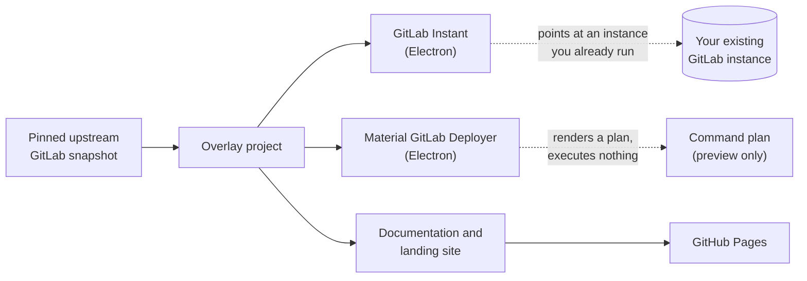

<div align="center">

# Material GitLab

**A Material Design overlay project built on a pinned upstream GitLab tree, with Windows tooling and a published documentation site.**

[](https://github.com/Ding-Ding-Projects/material-gitlab/actions/workflows/pages.yml)
[](https://github.com/Ding-Ding-Projects/material-gitlab/actions/workflows/windows-release.yml)


**Site:** [ding-ding-projects.github.io/material-gitlab](https://ding-ding-projects.github.io/material-gitlab/)

</div>

---

## What this actually is, in one honest paragraph

This repository is a **Material Design overlay** around a pinned snapshot of upstream GitLab. It
tracks 107,565 files, but almost all of those are the upstream GitLab source, carried as a single
squashed import for provenance. The part this project actually wrote is small and specific: two
Windows desktop shells, a documentation and landing site, the release and Pages automation, and the
supporting scripts. If you are looking for a running GitLab, read
[Deployment status](#deployment-status-read-this-before-you-plan-anything) first, because the
honest answer is not the one the directory listing suggests.

> [!IMPORTANT]
> **Nothing in this repository deploys GitLab.** Both desktop tools are configuration and preview
> surfaces by explicit design, and the `docker-compose.yml` at the root is a one line stub that
> points at the upstream `gitlab/gitlab-ce` image rather than anything built here. The detail is in
> [Deployment status](#deployment-status-read-this-before-you-plan-anything).

---

## Contents

| Section | What you get |
| --- | --- |
| [Quick start](#quick-start) | The two commands that build this on a clean Windows machine |
| [What ships](#what-ships) | The two desktop tools and the site, and what each one really does |
| [Deployment status](#deployment-status-read-this-before-you-plan-anything) | The honest answer about deploying |
| [Screens](#screens) | Verified captures from the built artifact |
| [Repository layout](#repository-layout) | Where the overlay code lives inside the upstream tree |
| [Size of the work](#size-of-the-work) | Measured line counts and a human time estimate |
| [Provenance](#provenance) | The pinned upstream commit and its fail closed validator |
| [Verification](#verification) | What passes, what fails, and what has never run |
| [Releases](#releases) | Why there are none yet |

---

## Quick start

Both scripts assume a completely fresh Windows machine. They bootstrap what is missing, build, and
report each phase with its elapsed time.

```bat
build.bat
build-installer.bat
```

Add `/s` (or `--silent`, or set `SILENT=1`) for an unattended run with no prompt:

```bat
build.bat /s
build-installer.bat /s
```

`build.bat` asks whether to launch the result only after a successful build. `build-installer.bat`
produces and verifies a local unsigned installer and never publishes, tags, or contacts a release
service. Full detail lives in [BUILD.md](BUILD.md).

<details>
<summary><b>Per package commands</b></summary>

```bash
# Deployer shell
cd tools/material-gitlab-deployer
npm run build      # tsc + asset copy
npm start          # launch the Electron preview shell
npm test           # node --test test/*.test.mjs

# Instant shell
cd tools/material-gitlab-instant
npm run build
npm start
npm test

# Documentation and landing site
cd site
npm run dev        # vite dev server
npm run build      # production build into site/dist
npm run preview
```

</details>

---

## What ships



### GitLab Instant

A small Electron shell that stores an origin URL, polls that origin's `/-/readiness` endpoint over
a bounded 2.5 second timeout, and opens a window on the instance once it answers `200` or `204`. It
refuses to follow redirects to an arbitrary host. It does **not** install, start, provision, or
deploy anything. It expects a GitLab instance that is already running and reachable.

### Material GitLab Deployer

An Electron shell that validates a deployment configuration for WSL2, local Docker, or SSH Docker
targets and renders an allowlisted, redacted command plan for review. Quoting its own
[README](tools/material-gitlab-deployer/README.md):

> The shell is preview-only. It validates configuration and renders an allowlisted plan, but never
> executes Docker, WSL2, SSH, or arbitrary shell commands.

The only child process it launches is `where.exe`, to test whether a command exists on the machine.
SSH `secretRefs` are opaque references for a future credential vault and are never resolved.

### Documentation and landing site

A Vite site under [`site/`](site/) carrying the landing page, offline documentation, a changelog
view, and a command palette. It is published to GitHub Pages from `main` only.

---

## Deployment status, read this before you plan anything

This section exists because the repository looks far more deployable than it is.

| Route | State | Detail |
| --- | --- | --- |
| `docker-compose.yml` | **Stub** | The entire file is `app:` and `image: gitlab/gitlab-ce:latest`. It has no `services:` key, so it is legacy v1 syntax, and it references the upstream community image rather than anything this project builds. |
| Material GitLab Deployer | **Preview only** | Renders a command plan. Executes nothing, by explicit design. |
| GitLab Instant | **Client only** | Opens an instance you already run. Provisions nothing. |
| GitLab tree itself | **Source install** | `INSTALLATION_TYPE` is `source` and `VERSION` is `19.3.0-pre`. A source install needs Ruby, PostgreSQL, Redis, Gitaly, Workhorse and gitlab-shell, and this repository automates none of it. |
| Container image | **Absent** | The only Dockerfiles are `Dockerfile.assets`, `qa/Dockerfile` and `vendor/Dockerfile`. None builds a runnable application image. |
| Helm or Kubernetes chart | **Absent** | No `chart/`, `helm/`, `k8s/`, or `deploy/` directory exists. |

> [!WARNING]
> To actually run GitLab, use an upstream distribution: the Omnibus package, the official Docker
> image, or the GitLab Helm chart. This repository is an overlay and a set of Windows tools around
> it, and treating it as a deployment source will not work.

---

## Screens

Captures below are real, taken from the **built** site artifact rather than the source tree, on a
hidden Windows desktop with an isolated guest browser profile and a background capture by window
handle. Each has a committed JSON receipt recording its source commit, route, viewport, theme,
display scale, method, and SHA-256. Both hashes were re-verified against the files in this commit.

<details open>
<summary><b>Landing page</b> (1264 x 892, light theme, 100% scale)</summary>


Receipt: [`site/evidence/landing-and-offline-docs.json`](site/evidence/landing-and-offline-docs.json)

</details>

<details>
<summary><b>Command palette, open</b> (1264 x 892, light theme, 100% scale)</summary>


Receipt: [`site/evidence/command-palette.json`](site/evidence/command-palette.json)

</details>

> [!NOTE]
> **Coverage is partial and it is worth saying so.** These two captures were taken at commit
> `c74f6331`, since when `site/index.html` has changed by 3 lines. There are no captures yet of the
> two desktop shells, of settings, dialogs, empty states, error states, the narrow layout, or the
> dark theme. Those surfaces are undocumented visually until real captures exist for them.

---

## Repository layout

Only the rows marked **overlay** were written by this project. Everything else is the pinned
upstream GitLab source.

| Path | Origin | Purpose |
| --- | --- | --- |
| `tools/material-gitlab-deployer/` | overlay | Deployment plan preview shell |
| `tools/material-gitlab-instant/` | overlay | Existing instance client shell |
| `tools/design-reference/` | overlay | Design parity harness |
| `site/` | overlay | Landing page, offline docs, changelog, command palette |
| `.github/workflows/` | overlay | Pages publish and Windows release |
| `scripts/release/line_count.mjs` | overlay | Committed line counter used by release automation |
| `scripts/verify-upstream-overlay.mjs` | overlay | Fail closed provenance validator |
| `build.bat`, `build-installer.bat` | overlay | One click Windows bootstrap and packaging |
| `app/`, `lib/`, `ee/`, `spec/`, `doc/`, ... | upstream | Pinned GitLab source, carried for provenance |

---

## Size of the work

Measured on this commit. Counts exclude `site/dist` build output, lockfiles, and binary assets, so
these are hand written lines rather than generated or vendored ones.

| Area | Files | Lines |
| --- | ---: | ---: |
| `site/` | 53 | 4,497 |
| `tools/material-gitlab-deployer/` | 22 | 1,071 |
| `tools/material-gitlab-instant/` | 22 | 803 |
| Root docs and build scripts | 8 | 631 |
| `.github/workflows/` | 5 | 531 |
| Overlay scripts | 4 | 378 |
| **Overlay total** | **114** | **7,911** |
| Tracked files in the whole repository | 107,565 | mostly pinned upstream source |

<details>
<summary><b>How long would a person have taken to write this by hand?</b></summary>

**Estimated at roughly 3 to 6 working months.** This is an estimate, not a measurement. Nobody
built it by hand, and the figure should be argued with rather than quoted.

The arithmetic: 7,911 hand written lines, at a sustained 60 to 120 lines per day of reviewed,
documented, and packaged code, gives 66 to 132 working days. At about 21 working days per month
that is 3.1 to 6.3 months.

What the range deliberately excludes: the pinned upstream GitLab source, which is the work of
hundreds of contributors over more than a decade and is not counted here at all; generated files;
lockfiles; and build output. The full machine readable breakdown, including surviving line
authorship split between agent and human, is produced by the committed counter and attached to each
release as `LINE-COUNT.json`.

```bash
node scripts/release/line_count.mjs --json --revision=HEAD
```

</details>

---

## Provenance

The overlay is pinned to the official upstream GitLab repository at
`https://gitlab.com/gitlab-org/gitlab.git`, commit
`9479feaa8d186fa47fc98321d9721b8f87199b26`.

```bash
node scripts/verify-upstream-overlay.mjs
```

[`scripts/verify-upstream-overlay.mjs`](scripts/verify-upstream-overlay.mjs) fails closed when the
provenance record is missing, malformed, points somewhere other than the canonical GitLab
repository, or names a commit that is not reachable from this checkout's history. It currently
passes.

---

## Verification

All results below were run locally on this commit. Each was run after a clean rebuild, because
these tests read compiled output rather than source.

| Check | Command | Result |
| --- | --- | --- |
| Upstream provenance | `node scripts/verify-upstream-overlay.mjs` | **Passes** |
| Published file shorthand scan | `node scripts/verify-public-vocabulary.mjs` | **Passes**, 54,754 files scanned |
| Design reference parity | `node --test test/*.test.mjs` in `tools/design-reference` | **6 of 6 pass**, includes a red then green negative regression |
| Site completeness | `node scripts/completeness-check.mjs` in `site` | **Passes**, 28 rows, every removal rejected |
| Deployer renderer boundary | `npm test` in `tools/material-gitlab-deployer` | **1 of 1 passes** after a clean build |
| Instant renderer boundary | `npm test` in `tools/material-gitlab-instant` | **1 of 1 passes** |
| Instant TypeScript build | `npm run build` in `tools/material-gitlab-instant` | **Passes**, see the note below |
| Pages site build and publish | GitHub Actions, `pages.yml` | **Passes on `main`** |
| Windows release and installers | GitHub Actions, `windows-release.yml` | **Has never completed successfully** |

> [!NOTE]
> **Rebuild before trusting these tests.** They read compiled output, not source. A stale `dist/`
> left over from an earlier source revision makes the deployer boundary test fail against a build
> that no longer corresponds to the tree, which reads exactly like a source defect and is not one.
> Delete the output directory and rebuild first.

> [!CAUTION]
> **The Instant package carries an unreferenced parallel implementation that does not compile.**
> `src/main/lifecycle.ts` and `src/shared/model.ts` arrived together in commit `105c8e932`. Nothing
> imports `lifecycle.ts`, and only `lifecycle.ts` imports `model.ts`. `lifecycle.ts` imports
> `defaultConfiguration` and `parseInstanceConfig`, which `shared/configuration.ts` does not export,
> and `model.ts` declares `Window.gitlabInstant` as a required readonly `GitlabInstantApi` while
> `shared/bridge.ts` declares the same property as an optional `GitLabInstantBridge`. Two
> conflicting global declarations for one property cannot coexist, so their presence failed the
> whole package build with `TS2305`, `TS2687` and `TS2717`, and `tsc` exited 2.
>
> They are currently excluded in `tsconfig.json` rather than deleted, so the package builds while
> the half-finished work stays visible. The wired implementation is
> `main.ts` to `main/bridge.ts` to `shared/configuration.ts` and `shared/bridge.ts`. Finish that
> island deliberately or remove it, then drop the exclude.

### Note on CI scope

Neither workflow runs tests, lint, or type checks. That is deliberate, and it means a green badge
above says the site published or the installers built, and says nothing about code quality. Run the
package test commands locally and read their real output.

---

## Releases

**There are none yet, and no tags exist.** The Windows release workflow builds two unsigned
Squirrel.Windows installers, and until recently it could never publish: it inlined the entire
line count JSON report into the release body, which for a tree this size serialises to about
161,000 characters against GitHub's 125,000 character ceiling, so publication failed with HTTP 422
every time it got that far. Other runs were cancelled at a 120 minute job timeout.

Both causes are now addressed on `main`. The release body carries a summary and ships the full
report as a `LINE-COUNT.json` asset, a fail closed guard names any future overrun explicitly
instead of failing as an opaque 422, and the job timeout is raised to the 360 minute GitHub hosted
runner ceiling. The first release remains unproven until a run actually publishes one.

When installers do ship they will be **unsigned**, because code signing is deliberately disabled in
this project. Windows will show an unknown publisher or SmartScreen warning. That is expected and is
not a sign the download is damaged.

---

## 廣東話簡介

呢個 repo 係一個 Material Design 外殼項目,包住一份釘死咗版本嘅上游 GitLab 原始碼。成
107,565 個檔案入面,絕大部分都係上游 GitLab,係為咗記錄出處先擺入嚟。真正自己寫嘅得
114 個檔案、7,911 行:兩個 Windows 桌面殼、一個文件同落地網站、加上發佈同 Pages 嘅自動化。

**最緊要一句:呢度冇嘢部署到 GitLab。** 兩個桌面工具都係設定同預覽介面,設計上就係唔會執行
任何嘢;個 `docker-compose.yml` 得一行,指去上游嘅 `gitlab/gitlab-ce` 鏡像,唔關呢個項目事。
想真係跑 GitLab,請用上游嘅 Omnibus、官方 Docker 鏡像或者 Helm chart。

目前仲未出過任何 release。將來出嘅安裝檔一律唔簽名,Windows 會彈「不明發行者」警告,呢個
係預期之內,唔係個檔案有問題。

---

## License

The upstream GitLab source retains its original licensing; see [LICENSE](LICENSE), which begins
"Copyright (c) 2011-present GitLab Inc." The `tools/material-gitlab-instant` package declares MIT.
This is an independent overlay project and is not affiliated with, endorsed by, or supported by
GitLab Inc.
